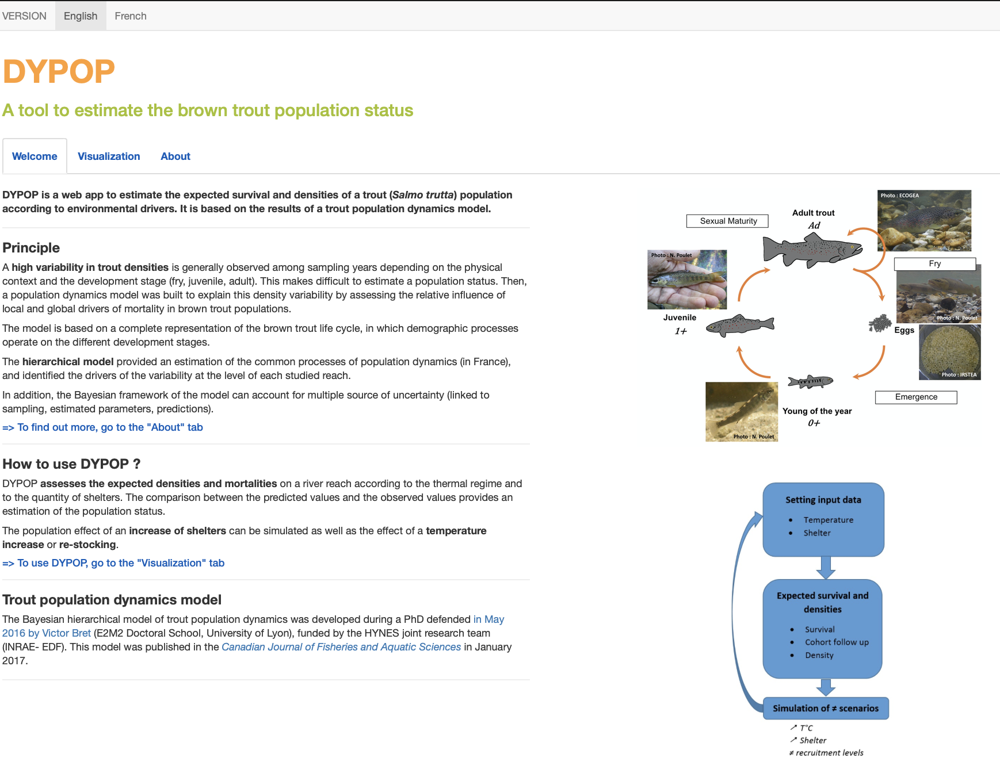

# DYPOP : DYnamics POPulation (brown trout)

[**DYPOP**](https://dypop.pam-retd.fr) is a free SaaS (Software as a Service) developed by EDF. It is the result of a thesis work supported in May 2016 by Victor Bret (E2M2 Doctoral School, University of Lyon), funded by the HYNES joint research team (Irstea-EDF).

  

   <b>DYPOP (Shiny app)</b> 

# References

* Victor Bret, [Dynamique spatio-temporelle des populations de truites en milieu naturel et au voisinage des ouvrages hydroélectriques](https://tel.archives-ouvertes.fr/tel-01382903), thèse, 2016
* Victor Bret, Hervé Capra, Véronique Gouraud, Nicolas Lamouroux, Jérémy Piffady, Laurence Tissot, Etienne Rivot, [Understanding inter-reach variation in brown trout (Salmo trutta) mortality rates using a hierarchical Bayesian state-space model](http://www.nrcresearchpress.com/doi/10.1139/cjfas-2016-0240), Canadian Journal of Fisheries and Aquatic Sciences, 2017

# Licence

[CeCILL](http://www.cecill.info/index.en.html) v2.1

# Contribution

For any support please see the about page of the [application](https://dypop.pam-retd.fr).

